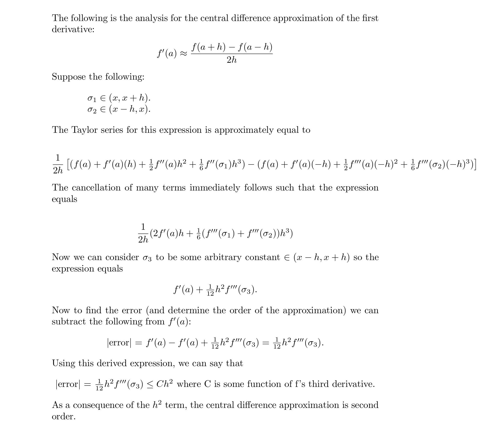
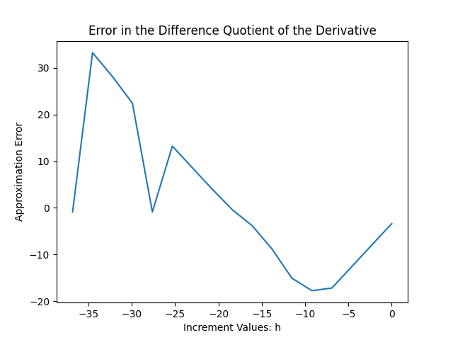

### MATH 4610: Fundementals of Computational Mathematics 
***

## TASK 2:

### Question 1:

Using the Java programming language, a program was written to respond to the pythong line, "it's only a bunny...". The following block provides the code. Upon execution the text contained in the **printScreen()** method is written to the console.


```java
public class task1 {
    public static void main(String[] args) {
        printScreen();
    }

    public static void printScreen(){
        System.out.println("That's no ordinary rabbit. That's the most foul, cruel, and bad-tempered rodent you ever set eyes on.");
    }
}
```

### Question 2:

A page with links to all homework assignments was created [here](homework_assigments.md). A software manual was created [here](). 

### Question 3:



### Question 4:

A program was written with Java to approximate the derivative of the function f '' (x) = -cos(x) using the central 
difference approximation (CDA) method. The code is given [here](code/task2/approximator.java).


The values shown in the following table include the value of h,
the true value of f '' (2), CDA of f '' (x) at x = 2 + h, and the difference
between the approximate and true value (error). 

```
                   h                Value         Approximate value                Error
                (ΔX)               f''(2)                     (CDA)       (CDA - cos(2))
                   -                -----         -----------------       --------------
            1.00e+00         0.4161468365         0.3826034824         0.0335433542
            5.00e-01         0.4161468365         0.4075490369         0.0085977997
            1.00e-01         0.4161468365         0.4158001631         0.0003466735
            1.00e-02         0.4161468365         0.4161433687         0.0000034679
            1.00e-03         0.4161468365         0.4161468019         0.0000000346
            1.00e-04         0.4161468365         0.4161468170         0.0000000195
            1.00e-05         0.4161468365         0.4161471168         0.0000002802
            1.00e-06         0.4161468365         0.4160005673         0.0001462692
            1.00e-07         0.4161468365         0.4385380947         0.0223912582
            1.00e-08         0.4161468365         1.1102230246         0.6940761881
            1.00e-09         0.4161468365         55.511151231         55.095004394
            1.00e-10         0.4161468365         5551.1151231         5550.6989762
            1.00e-11         0.4161468365         555111.51231         555111.09616
            1.00e-12         0.4161468365         0.00                 0.4161468365
            1.00e-13         0.4161468365         5.55e9               5.55e9
            1.00e-14         0.4161468365        -1.66e12             -1.66e12
            1.00e-15         0.4161468365         2.77e14              2.77e14
            1.00e-16         0.4161468365         0.00                 0.4161468365
```
The error tends to decrease with the value of h until h = .00001, at which point the error sharply increases. 
Using Python, a plot of the logged h value vs the logged error was acquired. 



The slope of the error decrease was measured using the linregress method from the scipy.stats method (the code is available [here](code/task2/plot.py)). The decreasing portion of the line had a slope of 1.997, or about 2. Because the slope of the line is arbitrarily close to 2, we confirm that this is a second order approximation.
