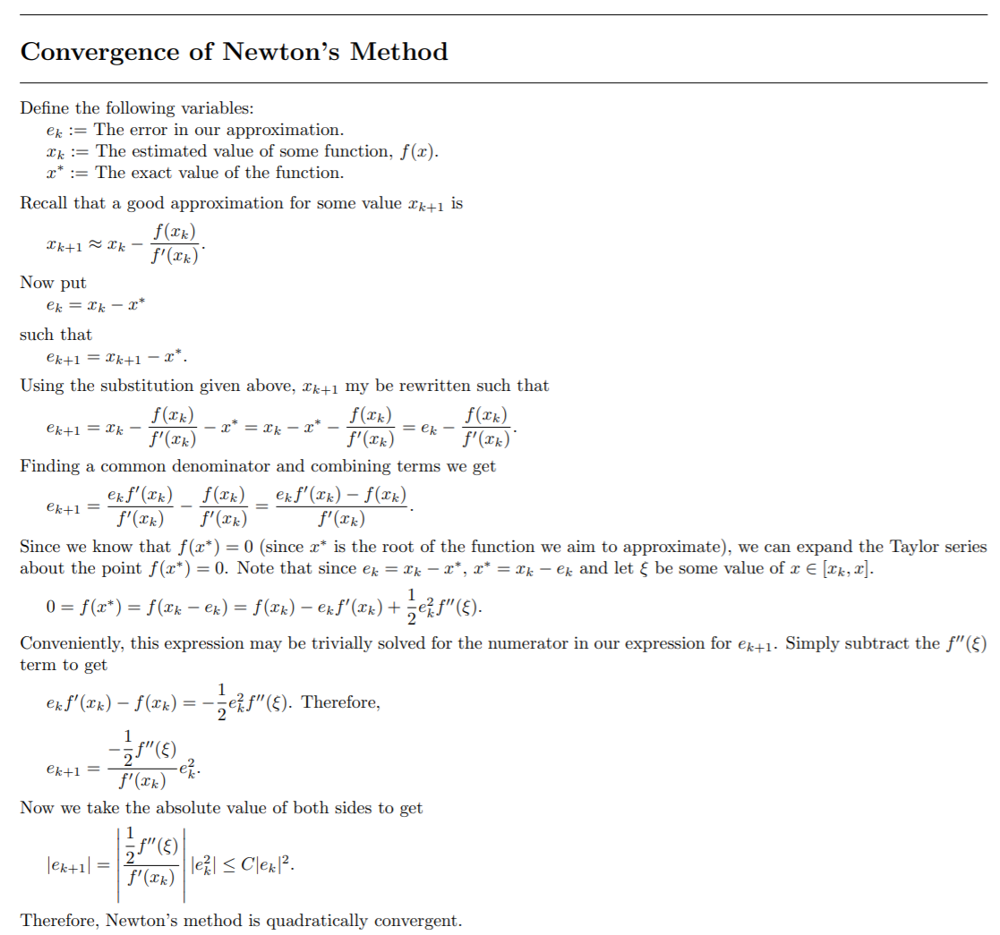
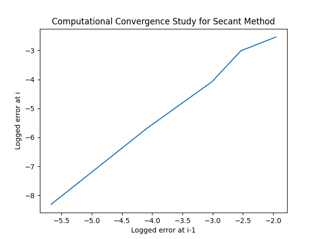

### MATH 4610: Fundementals of Computational Mathematics 
***

## TASK 5:

### Question 1:

Newton's method was implemented to approximate the root of the function given in tasksheet 4. Newton's method 
approximated roots much faster than did functional iteration or the bisection method. With a tolerance of 0.0001,
Newton's method found a root in just five steps. Implementation details may be found [here](https://github.com/HyrumHansen/math4610/blob/main/code/task5/NewtonsMethod.md). See below for example usage and output.

```java
public class main {
    public static void main(String[] args) {

        FunctionObject function = new FunctionObject();

        NewtonsMethod testObject = new NewtonsMethod();
        double result = testObject.newtonsRoot(function, -1, 0.0001, 30);
        System.out.printf("\n\nRoot: %f", result);
    }
}
```

produces

```java
 Error 1: 0.097947
 Error 2: 0.066814
 Error 3: 0.026410
 Error 4: 0.003399
 Error 5: 0.000050

Root: -0.805380
```

### Question 2:

The secant method was implemented to approximate the root of the function given in tasksheet four. The secant method was not quite as fast as Newton's
method but was still much faster than functional iteration. Implementation details may be found [here](https://github.com/HyrumHansen/math4610/blob/main/code/task5/SecantMethod.md). See below for example usage and output.

```java
public class main {
    public static void main(String[] args) {

        FunctionObject function = new FunctionObject();

        SecantMethod testObject = new SecantMethod();
        double result = testObject.secantRoot(function, -1, 1.1, 0.0001, 30);
        System.out.printf("\n\nRoot: %f", result);
    }
}
```

produces

```java
 Error 1: 0.586299
 Error 2: 1.619374
 Error 3: 0.881131
 Error 4: 0.503317
 Error 5: 0.464616
 Error 6: 0.016057
 Error 7: 0.002814
 Error 8: 0.000000

 oot: -0.000000
```

### Question 3:



### Question 4:

A computational convergence study was conducted using the function given in tasksheet 4. The mean decrease in error was most stable in the midrange of the data, so linear regression was performed on the middle six error values. The code below was used to generate the solutions for this question.

```python
import numpy as np
from matplotlib import pyplot as plt
from scipy.stats import linregress


errorValues = [0.097970, 0.141670, 0.079329, 0.049263, 0.016956, 0.003442, 0.000245, 0.000004]

plotValues = []
xVals = []
yVals = []

for i in range(len(errorValues) - 1):
    i += 1
    plotValues.append([errorValues[i-1], errorValues[i]])

for i in range(len(plotValues) - 1):
    xVals.append(np.log(plotValues[i][0]))

for i in range(len(plotValues) - 1):
    yVals.append(np.log(plotValues[i][1]))

print(yVals)

plt.plot(xVals[1:6], yVals[1:6])
plt.title("Computational Convergence Study for Secant Method")
plt.xlabel("Logged error at i-1")
plt.ylabel("Logged error at i")
plt.savefig('plot1.png')
plt.show()


print(linregress(xVals[1:6], yVals[1:6]))
```

The resultant slope value from the linregress method was approximately 1.593, which is not far from our expected value of 1.62. The plot below shows the iterative reduction in error.



Thus, we conclude that the secant method is neither quadratically nor linearlly convergent. Therefore, it is superlinearlly convergent.

### Question 5:

A hybrid method was built using Newton's method in conjunction with 4 steps of the bisection method to approximate roots. The output was predictable and is shown below. Implementation details may be found [here](https://github.com/HyrumHansen/math4610/blob/main/code/task5/HybridMethod.md).

```
0.8053980642331949
```

### Question 6:


